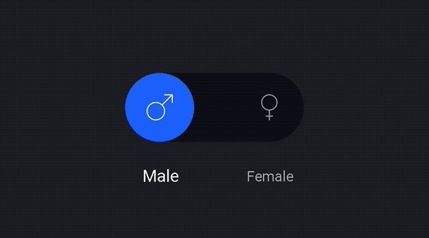

# StickySwitch

[]()
[](https://android-arsenal.com/api?level=15)
[](https://android-arsenal.com/details/1/5433)
[](https://jitpack.io/#GwonHyeok/StickySwitch)

StickySwitch library for android

this library is beautiful switch widget with sticky animation



## Requirements
- Android SDK 15+

## Usage

Add it in your root build.gradle at the end of repositories
```Groovy
allprojects {
    repositories {
        ...
        maven { url 'https://jitpack.io' }
    }
}
```

Add the dependency
```Groovy
dependencies {
    compile 'com.github.GwonHyeok:StickySwitch:0.0.7'
}
```

## How to use this library
Add `StickySwitch` to your xml layout
```xml
<io.ghyeok.stickyswitch.widget.StickySwitch
        android:id="@+id/sticky_switch"
        android:layout_width="wrap_content"
        android:layout_height="wrap_content"
        android:layout_centerInParent="true"
        app:iconPadding="18dp"
        app:iconSize="22dp"
        app:leftIcon="@drawable/ic_male"
        app:leftText="Male"
        app:rightIcon="@drawable/ic_female"
        app:rightText="Female"
        app:selectedTextSize="14sp"
        app:sliderBackgroundColor="@color/colorSliderBackground"
        app:switchColor="@color/colorSwitchColor"
        app:textColor="@color/colorTextColor"
        app:textSize="12sp" />
```

## Available attributes
|          Name          |    Type   | Description |
|:----------------------:|:---------:|:-----------:|
|       iconPadding      | dimension |      -      |
|        iconSize        | dimension |      -      |
|        leftIcon        |  integer  |      -      |
|        leftText        |   string  |      -      |
|        rightIcon       |  integer  |      -      |
|        rightText       |   string  |      -      |
|    selectedTextSize    | dimension |      -      |
|        textSize        | dimension |      -      |
|       switchColor      |   color   |      -      |
|  sliderBackgroundColor |   color   |      -      |
|        textColor       |   color   |      -      |

## Status change notification
StickySwitch.Direction has two value (LEFT, RIGHT)

onSelectedChange method called when you touch the switch.

When the switch is moved to the right, the direction variable is `StickySwitch.Direction.RIGHT`

also switch is moved to the left, that variable is `StickySwitch.Direction.LEFT`

Java Code Example
```java
// Set Selected Change Listener
StickySwitch stickySwitch = (StickySwitch) findViewById(R.id.sticky_switch);
stickySwitch.setOnSelectedChangeListener(new StickySwitch.OnSelectedChangeListener() {
    @Override
    public void onSelectedChange(@NotNull StickySwitch.Direction direction, @NotNull String text) {
        Log.d(TAG, "Now Selected : " + direction.name() + ", Current Text : " + text);
    }
});
```

## Direction
### if you want switch button direction to left
```java
stickySwitch.setDirection(StickySwitch.Direction.LEFT);
```

### Get current Direction
```java
stickySwitch.getDirection(); // StickySwitch.Direction.LEFT
```

## Text
### get current status text
```java
stickySwitch.getText()
```

### get specific status text
```java
stickySwitch.getText(StickySwitch.Direction.LEFT) // Get leftText
```

### set left or right text
```java
stickySwitch.setLeftText("Left");
stickySwitch.setRightText("Right");
```

## Icon
### set left icon with drawableRes
```java
stickySwitch.setLeftIcon(R.mipmap.ic_launcher);
```

### set left icon with drawable
```java
Drawable drawable = getDrawable(R.mipmap.ic_launcher);
stickySwitch.setLeftIcon(drawable);
```

## Color
### set colors
```java
// The color format must be (0xAARRGGBB)
stickySwitch.setSliderBackgroundColor(0xFF181821);
stickySwitch.setSwitchColor(0xFF2371FA);
stickySwitch.setTextColor(0xFFFFFFFF);
```

# Reference
#### Talos Onboarding
   - [dribbble](https://dribbble.com/shots/3047204-Talos-Onboarding)
   - [material-uplabs](https://material.uplabs.com/posts/talos-onboarding)

# License
```
MIT License

Copyright (c) 2017 GwonHyeok

Permission is hereby granted, free of charge, to any person obtaining a copy
of this software and associated documentation files (the "Software"), to deal
in the Software without restriction, including without limitation the rights
to use, copy, modify, merge, publish, distribute, sublicense, and/or sell
copies of the Software, and to permit persons to whom the Software is
furnished to do so, subject to the following conditions:

The above copyright notice and this permission notice shall be included in all
copies or substantial portions of the Software.

THE SOFTWARE IS PROVIDED "AS IS", WITHOUT WARRANTY OF ANY KIND, EXPRESS OR
IMPLIED, INCLUDING BUT NOT LIMITED TO THE WARRANTIES OF MERCHANTABILITY,
FITNESS FOR A PARTICULAR PURPOSE AND NONINFRINGEMENT. IN NO EVENT SHALL THE
AUTHORS OR COPYRIGHT HOLDERS BE LIABLE FOR ANY CLAIM, DAMAGES OR OTHER
LIABILITY, WHETHER IN AN ACTION OF CONTRACT, TORT OR OTHERWISE, ARISING FROM,
OUT OF OR IN CONNECTION WITH THE SOFTWARE OR THE USE OR OTHER DEALINGS IN THE
SOFTWARE.
```
